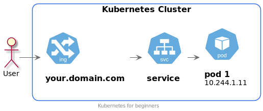

# Pod + Service (Шаг 1)

## Namespace
```shell script
# Создание namespace
kubectl apply -f manifests/00-namespace.yaml

## Проверяем созданный namespace
kubectl get ns
```

## Pod
### Создание
```shell script
# Создание namespace
kubectl apply -f manifests/00-namespace.yaml 

# Создание пода
kubectl apply -f manifests/10-pod.yaml

# Проверяем созданный под
kubectl -n step1 get po
```

Pod создан. 

### Проверка
```shell script
# Проверяем созданный под
kubectl -n step1 get po

# Направим трафик с локального компьютера на pod
kubectl port-forward -n step1 pods/frontend 8080:80
# Трафик с адреса 127.0.0.1:8080 будет направлен внутрь пода

# В соседней вкладке терминала
curl 127.0.0.1:8080
```

Pod отвечает. Но это направляет только трафик с нашего компьютера. 
При завершении работы команды `kubectl port-forward` перенаправление трафика завершится.  
Нужно на этот pod направить трафик из публичной сети.

## Доступ к поду через Service ClusterIP
Трафик в Pod-ы направляют с помощью объекта Service.
Для трафика внутри кластера используют Service типа ClusterIP.

```shell script
# Создание Service
kubectl apply -f manifests/20-service-ClusterIP.yaml

# Проверяем созданный Service
kubectl -n step1 get svc
kubectl -n step1 get service

# Направим трафик с локального компьютера на pod
kubectl port-forward -n step1 services/frontend 8080:80
# Трафик с адреса 127.0.0.1:8080 будет направлен внутрь пода через Service

# В соседней вкладке терминала
curl 127.0.0.1:8080
```

Все работает, как и прежде. Разница в том, что внутри кластера напрямую к поду можно обратиться только по IP адресу.
Проблема в том, что этот IP адрес не является стабильным и он неизвестен заранее.
К сервису (а точнее к подам через сервис) можно обращаться по имени.

## Service NodePort
Внешний трафик в сеть можно направить с помощью объекта Service.  
Создадим Service типа NodePort.

Этот сервис сделает доступным ваше приложение снаружи кластера.
Вы можете отправить запрос на любую ноду своего кластера с указанием порта. 

```shell script
# Создание Service
kubectl apply -f manifests/30-service-NodePort.yaml

# Проверяем созданный Service
kubectl -n step1 get svc

# В соседней вкладке терминала. IP 10.0.10.107 адрес одной из ваших нод. 
curl http://10.0.10.107:30080/
```

Мы можем обратиться к любой ноде нашего кластера

Теперь Pod доступен снаружи кластера.


## Ingress
Обращаться к приложению по номеру порта очень неудобно.
Более привычно обращаться по URL.
Для решения такой задачи в Kubernetes предусмотрен объект Ingress.

```shell script
# Создание Service
kubectl apply -f manifests/40-ingress.yaml

# Проверяем созданный Service
kubectl -n step1 get ing

# В соседней вкладке терминала. IP 10.0.10.107 адрес одной из ваших нод. 
curl http://kopylov.duckdns.org
```

Теперь к нашему приложению мы можем обратиться по URL. 

Для простоты рассуждений можно сформулировать так:

Трафик к приложению идет по маршруту:
Ingress -> Service типа ClusterIP -> Pod.



В действительности все немного сложнее. Но нам пока достаточно такой формулировки.  
