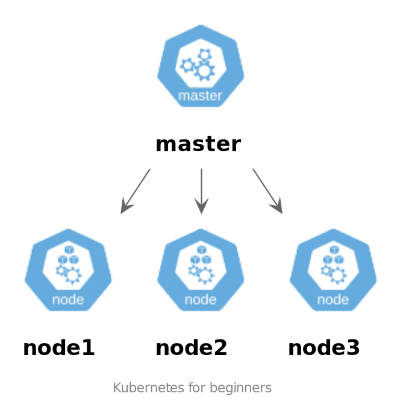
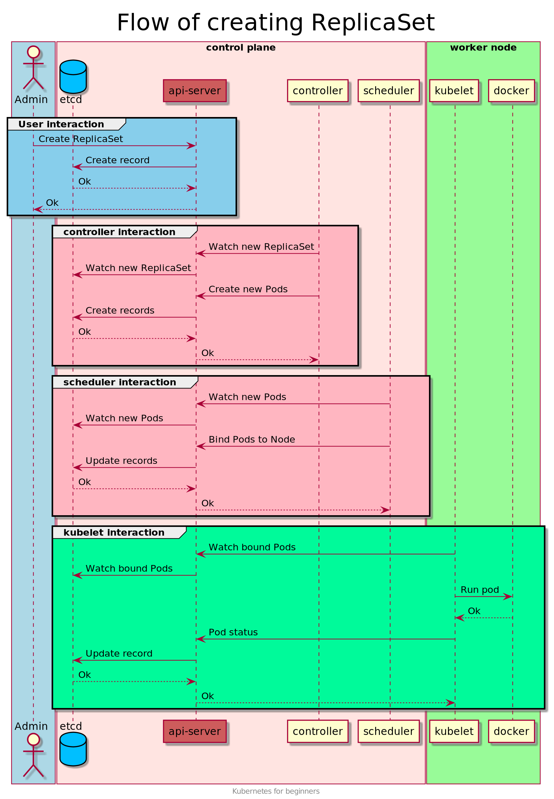

# Кластер Kubernetes

## Kubernetes
Kubernetes является воплощением идеи перехода `from pets to cattle` (от любимцев к скоту).
Это относится и к серверам и к экземплярам приложений. 
Kubernetes толерантен к потере ноды, а экземпляры приложений он сам создает и сам же уничтожает.
Ваше приложение должно быть к этому готово, а об остальном позаботится Kubernetes.

## Базовые понятия
- Кластер — группа компьютеров, объединённых высокоскоростными каналами связи и представляющая с точки зрения пользователя единый аппаратный ресурс.
- Масштабирование — способность системы, сети или процесса справляться с увеличением рабочей нагрузки (увеличивать свою производительность) при добавлении ресурсов (обычно аппаратных).
- Kubernetes — ПО для оркестровки контейнеризированных приложений — автоматизации их развёртывания, масштабирования и координации в условиях кластера.

## Схема кластера

## Кластер Kubernetes
Кластер - это набор из нескольких серверов. Только так кластер может обеспечить надежное функционирование ваших приложений.

Кластер Kubernetes состоит из двух видов нод:
- рабочая нода;
- master или control plane node.

### Рабочие ноды 
Рабочие ноды служат для запуска подов с рабочей нагрузкой. Один кластер может содержать до 5000 рабочих нод. 

Для того чтобы поды попали на нужную рабочую ноду нужны специальные ноды - control plane ноды или master ноды. В дальнейшем изложении `master node` эквивалентно  `control plane node`.

### Сontrol plane ноды 
Control plane node - это управляющая нода.
Для небольших кластеров может быть достаточно одной `control plane` ноды. Одна нода может справится с нагрузкой небольшого кластера.
Однако такой кластер не является отказоустойчивым.
Для обеспечения отказоустойчивости и масштабирования запускают несколько control plane нод.
Во избежание `split brain` таких нод должно быть нечетное число.

На `control plane` нодах запускают дополнительный набор служебных приложений.
Эти приложения обеспечивают управление кластером. Например управляют распределением подов по рабочим нодам и контролируют функционирование рабочих нод.
Кратковременная потеря такой ноды допустима, но не очень желательна.
Например при развертывании приложения потеря master ноды может привести к непредсказуемым последствиям.

### Примечание
- Рабочая нагрузка может быть запущена и на Control plane нодах.
- Для запуска Kubernetes достаточно одной ноды. Но такой "кластер" подходит разве что для тестов и разработки.

## Компоненты кластера Kubernetes
Управление кластером происходит декларативно. Админ указывает желаемое состояние кластера. Это состояние сохраняется в распределенное key-value хранилище etcd.
А компоненты кластера приводят кластер в такое желаемое состояние. Позже мы рассмотрим один из примеров такого поведения.

## Работа кластера
Прежде чем перейти к более подробному рассмотрению компонентов Kubernetes рассмотрим как создается ReplicaSet.

Админ отправляет в кластер запрос о создании ReplicaSet и довольно быстро получает ответ. Но это только начало работы.
Дальнейший процесс можно увидеть на схеме создания объектов Kubernetes.

Каждый из компонентов выполняет свою часть работы. Выглядит сложно. Но это очень гибкий подход.

На этой схеме видно самые горячие части системы. Это kube-apiserver и etcd.
Если у вас большой кластер, то может появиться необходимость в масштабировании этих компонентов.
Есть несколько вариантов масштабирования, но пока мы их рассматривать не будем.    

Теперь когда мы рассмотрели работу кластера с высоты птичьего полета можно приступить к более подробному рассмотрению отдельных компонентов.  

## Подробнее о компонентах кластера Kubernetes
Функционирование Kubernetes обеспечивается небольшим числом приложений. Такие приложения называются компонентами Kubernetes.

Вот набор этих приложений:
- kube-apiserver
- kube-controller-manager
- kube-cloud-controller-manager
- kube-scheduler
- etcd
- kubelet
- kube-proxy

Master нода обычно содержит все эти компоненты. Исключение может составлять etcd. 
Можно использовать отдельный кластер etcd.

На рабочих нодах установлены только два компонента:
- kubelet
- kube-proxy

### Компоненты control plane node
#### Kube-apiserver
Kube-apiserver является точкой входа в кластер. Этот компонент предоставляет REST API и отвечает по https. Все управление кластером происходит через kube-apiserver.
 
Kube-apiserver - это связующее звено для всех компонентов системы. Все общение компонентов идет через этот компонент.
Можно представить этот компонент как шину, к которой подключены другие компоненты.

#### etcd
Распределенное key-value хранилище. 
В простейшем случае etcd может быть запущен на мастер-нодах. Для обеспечения максимальной производительности и отказоустойчивости это может быть отдельный кластер на выделенных серверах.
У этой БД есть интересная особенность. В этой БД одновременно сохраняются несколько версий одного и того же значения. Эта особенность активно используется компонентами kubernetes.

Компоненты Kubernetes отслеживают изменения интересующих их ключей или точнее сказать целых папок ключей.
 Когда происходит изменения в таких ключах компонент начинает свою активную работу. Рассмотрим как это работает в случае kube-scheduler.

#### kube-scheduler
kube-scheduler отслеживает вновь созданные поды, которым не назначена нода и выбирает наиболее подходящую ноду.
Процесс выбора ноды довольно сложный и учитывает много аспектов.
Kubernetes предоставляет много возможностей для обеспечения гибкости работы kube-scheduler.
Если этих возможностей все же не хватает, то можно компонент kube-scheduler заменить на кастомный.

При пересоздании пода происходит вычисление его нового положения.
Если произойдет потеря ноды, то все поды, расположенные на этой ноде должны быть перераспределены на другие ноды. 
Поэтому для обеспечения отказоустойчивости необходимо резервировать ресурсы на рабочих нодах. То есть ноды не должны быть заполнены до отказа.

#### kube-controller-manager
kube-controller-manager состоит из нескольких специализированных компонентов, которые скомпилированы в один исполняемый файл:
- Node controller
- Job controller
- Replication controller
- Endpoints controller
- Service Account & Token controller
Все эти компоненты запущены в разных процессах.

##### Node controller
Опрашивает ноды на предмет их работоспособности. Записывает статусы нод в etcd.

##### Job controller
Отслеживает объекты Job. Создает поды для выполнения назначенных задач.

##### Endpoints controller
Связывает сервисы и поды.

##### Service Account & Token controller
Создает сервисные аккаунты и токены для новых namespace.

##### Replication controller
Отслеживает желаемое количество реплик. При изменении желаемого количества реплик создает записи в etcd о вновь созданных подах. У этих подов не будет назначена нода и дальше вступит в работу kube-scheduler.

#### cloud-controller-manager
Компонент содержит логику специфичную для облачного провайдера. 
Этот компонент связывает кластер с API облачного провайдера. 
Этим он отличается от остальных компонентов, которые работают только внутри кластера.

cloud-controller-manager запускает контроллеры специфичные для облачного провайдера. 
Когда вы запускаете Kubernetes на своих серверах, а тем более в учебных средах этот компонент не будет запущен.

Контроллеры, которые имеют взаимосвязи с API облачного провайдера:
- Node controller: Для проверки облачного провайдера была ли удалена нода после того, как она перестала отвечать.
- Route controller: Для настройки маршрутов в облачной инфраструктуре. 
- Service controller: Для создания, обновления и удаления балансировщиков нагрузки в облачной инфраструктуре.

### Компоненты worker node
#### kubelet
Агент, запущенный на каждой ноде. Обеспечивает запуск и контроль за работой подов на ноде. 
На входе получает спецификации подов. На основании спецификации происходит запуск пода.

#### kube-proxy
Сетевой прокси, который запущен на каждой ноде. Поддерживает работу сетевых правил на нодах.

### Дополнительные компоненты
Выше перечислены компоненты, которые созданы компанией Google. 
Есть несколько компонентов, которые создаются сторонними разработчиками. 
Это обеспечивает разнообразие и более высокую скорость разработки.   
Каждый администратор кластера может собрать кластер из нужных компонентов, которые наиболее отвечают их требованиям. 

#### Container Runtime
Обеспечивает работу запущенных контейнеров.
Kubernetes поддерживает несколько имплементаций Kubernetes-CRI: Docker, containerd, CRI-O.

#### DNS, Network 
DNS, Network - примеры компонентов, которые можно выбрать для использования в кластере.

## Расчет кластера
