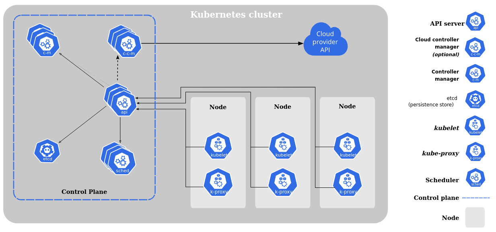

# Кластер Kubernetes

## Kubernetes
Kubernetes является воплощением идеи перехода `from pets to cattle` (от любимцев к скоту).
Это относится и к серверам и к экземплярам приложений. 
Kubernetes толерантен к потере ноды, а экземпляры приложений он сам создает и сам же уничтожает.
Ваше приложение должно быть к этому готово, а об остальном позаботится Kubernetes.

## Базовые понятия
- Кластер — группа компьютеров, объединённых высокоскоростными каналами связи и представляющая с точки зрения пользователя единый аппаратный ресурс.
- Масштабирование — способность системы, сети или процесса справляться с увеличением рабочей нагрузки (увеличивать свою производительность) при добавлении ресурсов (обычно аппаратных).
- Kubernetes — ПО для оркестровки контейнеризированных приложений — автоматизации их развёртывания, масштабирования и координации в условиях кластера.

## Схема кластера

## Кластер Kubernetes
Кластер - это набор из нескольких серверов. Только так кластер может обеспечить надежное функционирование ваших приложений.

Кластер Kubernetes состоит из двух видов нод:
- рабочая нода;
- master или control plane node.

### Рабочие ноды 
Рабочие ноды служат для запуска подов с рабочей нагрузкой. Один кластер может содержать до 5000 рабочих нод. 

Для того чтобы поды попали на нужную рабочую ноду нужны специальные ноды - control plane ноды или master ноды. В дальнейшем изложении `master node` эквивалентно  `control plane node`.

### Сontrol plane ноды 
Control plane node - это управляющая нода.
Для небольших кластеров может быть достаточно одной `control plane` ноды. Одна нода может справится с нагрузкой небольшого кластера.
Однако такой кластер не является отказоустойчивым.
Для обеспечения отказоустойчивости и масштабирования запускают несколько control plane нод.
Во избежание `split brain` таких нод должно быть нечетное число.

На `control plane` нодах запускают дополнительный набор служебных приложений.
Эти приложения обеспечивают управление кластером. Например управляют распределением подов по рабочим нодам и контролируют функционирование рабочих нод.
Кратковременная потеря такой ноды допустима, но не очень желательна.
Например при развертывании приложения потеря master ноды может привести к непредсказуемым последствиям.

### Примечание
- Рабочая нагрузка может быть запущена и на Control plane нодах.
- Для запуска Kubernetes достаточно одной ноды. Но такой "кластер" подходит разве что для тестов и разработки.

## Компоненты кластера Kubernetes

## Работа кластера
Управление кластером происходит декларативно. Админ указывает желаемое состояние кластера. А компоненты кластера приодят сам кластер в такое желаемое состояние.
Kube-apiserver является точкой входа в кластер. Этот компонент предоставляет REST API и отвечает по https. 
Kube-apiserver - это связующее звено для всех компонентов системы. Все общение компонентов идет через этот компонент. Этот компонент доступен снаружи кастера по https. Управление кластером также происходит через kube-apiserver.
Можно представить этот компонент как шину, к которой подключены другие компоненты.
Интересно, что получив команду на изменение состояния кластера, kube-apiserver не производит эти изменения. Он всего лишь сохраняет в распределенное key-value хранилище etcd.
Другие компоненты Kubernetes отслеживают изменения в этой БД и выполняют каждый свою работу.

Рассмотрим как выполняется подобная работа на примере создания ReplicaSet.

Админ отправляет в кластер запрос о создании ReplicaSet и довольно быстро получает ответ. Но это только начало работы.
Дальнейший процесс можно увидеть на схеме создания объектов Kubernetes.

## Расчет кластера
