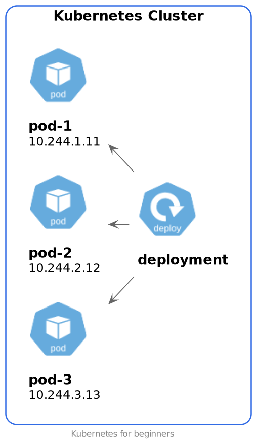
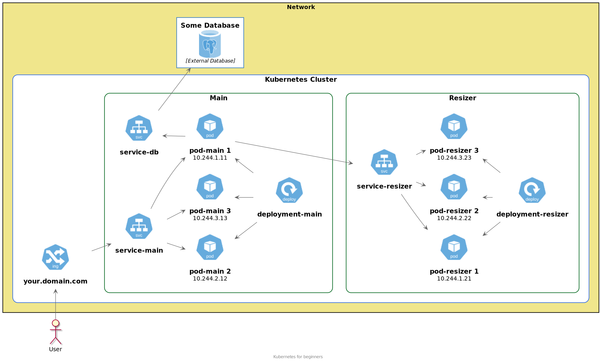

# Использование Kubernetes

## Disclaimer
Определения данные в этой лекции сознательно упрощены. Часть элементов опущена для простоты восприятия. 
Уточнения будут даны в соответствующих разделах.

## Зачем нужен Kubernetes
Любая система оркестровки контейнеров прежде всего нужна для выполнения какой-то полезной работы.
Второй задачей является распределение нагрузки между отдельными серверами.
Третья задача - это обеспечение доступа к переработанным данным снаружи кластера. Это опциональная задача. Данные могут быть и недоступны снаружи кластера.

Все объекты Kubernetes описываются манифестами. Обычно это yaml или json файл с конкретными спецификациями. 
Важно понимать разницу между объектом и его описанием. Объекты создаются в соответствии с описанием.

В данной лекции намеренно не приводятся никакие манифесты, чтобы не отвлекаться от основной идеи.

## Полезная нагрузка
Вы уже знакомы с концепцией docker контейнеров. 
Контейнеры предназначены для изолированного запуска полезной нагрузки. 
В Kubernetes расширили этот подход. Так появился pod.

### Pod
Pod предназначен для выполнения вычислений (полезной работы).
Pod в переводе с английского означает стручок, капсула. Стручок как известно содержит несколько бобов. 
Это неплохо отражает отличие пода от контейнера.

Очень упрощенно pod - это один или несколько контейнеров. Зачем нужно несколько контейнеров в одном поде? 
Это мы обсудим позже.


#### Демо
```shell script
# Под завершает свою работу едва стартовав
kubectl -n default run alpine --image=alpine

# Под завершит свою работу через 30 секунд
kubectl -n default run alpine2 --image=alpine -- sleep 30
```
В контейнере обязательно должен быть запущен процесс, чтобы контейнер не завершил свою работу. 

Pod, как и контейнер являются временными по своей природе. Поды могут создаваться и уничтожаться в любой момент времени. 
Приложение размещенное внутри пода должно быть готово к этому. Уничтоженный или удаленный под автоматически не создается вновь. 
Это и определяет главное свойство пода.

Если нужно увеличить вычислительные возможности нашего приложения нам нужно создать еще один или несколько подов. 
Новая версия приложения должна быть запущена в новом поде. Старые поды нужно вывести из эксплуатации. 
Делать это вручную крайне утомительно. 
Для решения проблемы масштабирования и развертывания новых версий предназначен специальный kubernetes объект - Deployment.

### Deployment 
Deployment предназначен для автоматического запуска подов, масштабирования и запуска новых версий приложений в подах.

Если pod был создан с помощью Deployment, то удаленный pod будет создан заново.
Для обеспечения отказоустойчивости и масштабирования может потребоваться создание нескольких однотипных подов. 
Этим тоже "занимается" Deployment. На самом деле этим занимается kube-controller-manager. 
Но для простоты восприятия пока будем говорить, что deployment контролирует заданное количество подов.



#### Демо
```shell script
# Развертывание deployment
kubectl apply -f manifests/20-deployment-main.yaml

# После удаление пода будет создан новый под
kubectl -n default delete pod main-

# Масштабирование. Увеличение числа реплик до 2
kubectl -n default scale --replicas=2 deploy main
```

## Сеть
Итак, полезная работа у нас выполняется подами. Deployment контролирует заданное количество подов. 
Достаточно ли этого для функционирования наших приложений?

Если pod содержит в себе все для выполнения полезной работы, то казалось бы нам больше ничего и не нужно. 
Но почти всегда нам требуются какие-то внешние ресурсы. Это и БД, и кэш и доступ к другим внутренним или внешним ресурсам.

### Проблема сетевого взаимодействия
Для простоты рассмотрим конкретный пример. У нас есть приложение, в которое мы загружаем изображение. 
Это изображение сохраняется в хранилище. Приложение может отдавать картинку в разных разрешениях.


На схеме мы видим два набора подов. Первый набор подов - монолит. 
Второй набор подов ресайзер изображений. Каждый из этих наборов контролируется собственным Deployment-ом.
Каждому поду присвоен собственный IP адрес.

#### Демо
```shell script
# Развертывание еще одного deployment 
kubectl apply -f manifests/21-deployment-resizer.yaml

# Проверяем созданные поды. У каждого пода собственное имя. "Родственные" поды объединены префиксами
kubectl -n default get pod -o wide

# Масштабирование. Увеличение числа реплик до 2
kubectl -n default scale --replicas=2 deploy main

# При удалении пода, новый создается с другим IP и другим именем
kubectl -n default delete pod main-

# Проверяем поды
kubectl -n default get pod -o wide
```

Каким образом можно обращаться из пода монолита к поду ресайзера?
По имени нельзя, это не предусмотрено в стандартном режиме Kubernetes и имя меняется как мы только что увидели. 
По IP можно, но IP меняется и кроме того не обеспечивается равномерная загрузка между подами.

### Service
Для решения заявленной выше проблемы предназначен объект с именем Service.

Service по заданным правилам находит поды и направляет трафик к поду. 
В сервисе указывается порт, на который будет отправлен трафик. 
Service может принять трафик с одного порта и отправить его на другой. 
В спецификации pod-а можно указать порт, на который он принимает трафик.
Это не является обязательным, но рекомендую это делать для наглядности. 

Добавляем на схему service.


Теперь для того, чтобы поды основного приложения могли обратиться к ресайзеру достаточно указать имя сервиса.
Сервис находит под и отправляет запрос в один из подов. 
Запросы отправляются в соответствии с правилом Round Robin. 
Это обеспечивает простейший механизм балансировки нагрузки.

Service кроме внутренней сетевой связанности может обеспечить и доступ к вашему приложению снаружи кластера. 
Этим занимается отдельный тип сервиса. Но это не вполне удобно по причине устройства service. 
Service может перенаправлять трафик с одного порта на другой. 
А мы привыкли в браузере набирать не IP адрес, а доменное имя.

#### Демо
```shell script
# Добавляем сервис
kubectl apply -f manifests/30-service-main.yaml
kubectl apply -f manifests/31-service-resizer.yaml

# Добавляем сервис для доступа снаружи кластера
kubectl apply -f manifests/35-service-nodeport.yaml

# Проверяем доступность сервиса снаружи кластера
curl http://178.154.196.182:32180
```

### Ingress
Для обеспечения доступа снаружи кластера к ресурсам этого кластера служит объект Ingress.
Ingress содержит в себе описания доменных имен, URI и сервисов, которые будут обрабатывать соответствующий трафик.

#### Демо
```shell script
# Добавляем сервис
kubectl apply -f manifests/30-service-main.yaml
kubectl apply -f manifests/31-service-resizer.yaml

# Добавляем сервис для доступа снаружи кластера
kubectl apply -f manifests/35-service-nodeport.yaml

# Сервис стал доступен снаружи кластера по привычному имени
curl -k https://main.akop.pw
```

Добавляем в схему Ingress.


Теперь получилась минимально возможная схема для работы довольно простого сайта. Нужно конечно еще сюда добавить БД.

Добавляем в схему БД.


Выглядит сложновато? Так и есть. Kubernetes создан не для самых простых сайтов.
В Kubernetes можно запустить и простейший сайт. И вы скоро сможете это делать довольно просто и быстро. 
В любом случае использовать Kubernetes или нет - решение за вами.

## Итоги
Итак, мы рассмотрели минимальный набор объектов kubernetes.
Этих объектов достаточно для знакомства с Kubernetes и применения его на практике.

Вспомним эти объекты:

**Pod** - это набор контейнеров. Служит для выполнения вычислений. Внутри пода выполняется вся основная работа.

**Deployment** - объект, который запускает необходимое количество подов. Служит для обеспечения отказоустойчивости и масштабирования вашего приложения.

**Service** - обеспечивает сетевую связанность между приложениями в кластере. Может вести наружу кластера и внутрь кластера.

**Ingress** - обеспечивает доступ внутрь кластера по имени.

На этом вводный материал по использованию Kubernetes завершен.
Теперь вы готовы к восприятию информации по устройству кластера Kubernetes и более подробной информации об объектах Kubernetes.

## Что дальше?
Для администратора будет интересно узнать об устройстве кластера Kubernetes.
Разработчику рекомендую ознакомиться с объектами Kubernetes более подробно. 

Для такого знакомства вам понадобиться работающий кластер Kubernetes. 
Если у вас нет такого кластера, то вот [инструкция](https://kubernetes.io/ru/docs/tasks/tools/install-minikube/) по установке minikube на локальную машину или виртуалку.
