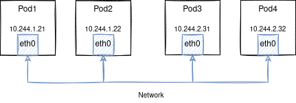

# Первый уровень погружения в сети

1. У каждого пода есть свой IP адрес. Этот адрес уникальный в рамках кластера.
1. У каждого контейнера внутри пода один и тот же IP адрес. Эти контейнеры работают в рамках одного компьютера.
1. Поды связаны собой сетью. Эта сеть как-то работает.

