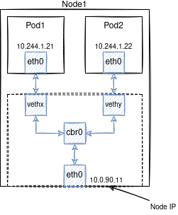

# Второй уровень погружения в сети

1. У каждого пода есть свой IP адрес. Этот адрес уникальный в рамках кластера.
1. У каждого контейнера внутри пода один и тот же IP адрес. Эти контейнеры работают в рамках одного компьютера.
1. Поды связаны собой сетью. Эта сеть как-то работает.
1. При инициализации кластера выбирается размер подсети для всего кластера.
1. Каждой ноде выделяется своя подсеть.  
1. IP адрес для пода выделяется из подсети ноды.
1. Ноде выделяется IP адрес тоже из этой подсети. Кроме этого на ноде есть IP адрес на физическом интерфейсе. 

