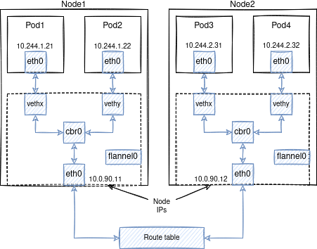

# Третий уровень погружения в сети

1. У каждого пода есть свой IP адрес. Этот адрес уникальный в рамках кластера.
1. У каждого контейнера внутри пода один и тот же IP адрес. Эти контейнеры работают в рамках одного компьютера.
1. Поды связаны собой сетью.
1. При инициализации кластера выбирается размер подсети для всего кластера.
1. Каждой ноде выделяется своя подсеть.  
1. IP адрес для пода выделяется из подсети ноды.
1. Ноде выделяется IP адрес тоже из этой подсети. Кроме этого на ноде есть IP адрес на физическом интерфейсе. 
1. kube-proxy создает на ноде правила iptables. Схема правил хранится в etcd.
1. Трафик между нодами ходит с помощью CNI плагина.
1. Трафик между нодами может быть запрещен с помощью NetworkPolicy если это предусматривает CNI плагин.



## Демо
Таблица маршрутизации
```shell script
route -n
```

## Сеть на нодах 
Зайдем на каждую из нод и убедимся в том, что на ноде создан отдельный диапазон сети. 
И из этого диапазона выделяются IP для подов.

Сначала смотрим на таблицу маршрутизации:
```shell script
# Таблица маршрутизации
route -n
```

Пример вывода для первой ноды:
```shell script
Kernel IP routing table
Destination     Gateway         Genmask         Flags Metric Ref    Use Iface
0.0.0.0         10.0.0.1        0.0.0.0         UG    100    0        0 eth0
10.0.0.0        0.0.0.0         255.255.255.0   U     0      0        0 eth0
10.0.0.1        0.0.0.0         255.255.255.255 UH    100    0        0 eth0
10.10.129.0     0.0.0.0         255.255.255.0   U     0      0        0 cbr0
172.17.0.0      0.0.0.0         255.255.255.0   U     0      0        0 docker0
```

Пример вывода для второй ноды:
```shell script
Kernel IP routing table
Destination     Gateway         Genmask         Flags Metric Ref    Use Iface
0.0.0.0         10.0.0.1        0.0.0.0         UG    100    0        0 eth0
10.0.0.0        0.0.0.0         255.255.255.0   U     0      0        0 eth0
10.0.0.1        0.0.0.0         255.255.255.255 UH    100    0        0 eth0
10.10.130.0     0.0.0.0         255.255.255.0   U     0      0        0 cbr0
172.17.0.0      0.0.0.0         255.255.255.0   U     0      0        0 docker0
```

Проверка распределения подов по нодам:
```shell script
kubectl get po -o wide
```
Обратите внимание на 3 октет IP адреса и имя ноды.  

kube-proxy создает правила iptables 
```shell script
iptables -t nat -vnL

# Удаление всех правил iptables. Не выполнять на production кластерах
iptables -F

# Через некоторое время правила будут созданы заново
iptables -t nat -vnL
```

Примерное количество подов запущенных на ноде:
```shell script
ip a | grep veth | wc -l
```

Можно сверить 
```shell script
kubectl get po -A -o wide | grep node1 | wc -l
```

## Подробная схема сети кластера

Здесь видно три приватных сети:
- 10.0.0.0/24 - сеть для нод;
- 10.10.128.0/16 - сеть для подов;
    - 10.10.128.0/24 - сеть для подов node1;
    - 10.10.129.0/24 - сеть для подов node2;
    - 10.10.130.0/24 - сеть для подов node3;
- 10.20.0.0/16 - сеть для сервисов;

- [Статья](https://itnext.io/kubernetes-networking-behind-the-scenes-39a1ab1792bb)
- [Перевод](https://habr.com/ru/company/flant/blog/420813/)
