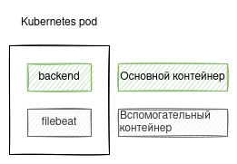
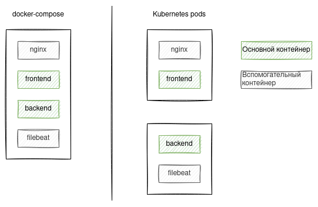

# Pod
[Документация](https://kubernetes.io/docs/concepts/workloads/pods/)

Pod является самым маленьким объектом в Kubernetes, в котором может быть запущена полезная нагрузка.
Pod состоит из одного или нескольких контейнеров. 



Вы уже знакомы с контейнерами по работе с docker.
В случае docker минимальная единица для запуска рабочей нагрузки - контейнер.
Контейнеры могут быть объединены в некоторую систему с помощью утилиты docker-compose.

В файле docker-compose.yml объединяют разные по назначению контейнеры. 
Это могут быть основные сервисы и вспомогательные сервисы.   



Создатели Kubernetes посчитали, что удобнее оперировать не одним контейнером, а несколькими взаимосвязанными контейнерами.
Такая связка контейнеров и будет являться подом.
Причем в один pod обычно помещают только один основной контейнер. 
В дополнение к нему могут поместить один или несколько вспомогательных. 

## Факты об объекте pod
- состоит из одного или нескольких контейнеров;
- у всех контейнеров один и тот же IP адрес;
- все контейнеры внутри видят друг друга как localhost;
- файловая система у контейнеров внутри пода разная;
- файловая система можно шарить между контейнерами;
- контейнеры пода начинают запускаться одновременно.

## Контейнеры
Есть два типа контейнеров в поде:
- init контейнеры;
- runtime контейнеры.

### Init контейнеры
- запускаются последовательно;
- запускаются перед основными контейнерами;
- могут шарить общие тома с контейнерами;
- требуются для начальной настройки.

### Runtime контейнеры
- запускаются одновременно;
- запускаются после init контейнеров. 

### Демо
```shell script
kubectl apply -f manifests/10-pod.yaml
kubectl get pods
kubectl get pods nginx -o yaml
kubectl describe pods nginx
kubectl describe pods nginx | grep "^IP:"
```
Под успешно запустился и готов к принятию трафика.


## Сеть
- у всех контейнеров пода один и тот же IP адрес;
- все контейнеры внутри видят друг друга как localhost.

### Демо
```shell script
kubectl apply -f manifests/30-pod-with-error.yaml

kubectl get pods
```
Только один из контейнеров успешно стартует. Второй находится в состоянии постоянного перезапуска.
Статус пода `CrashLoopBackOff`.

Команды для исследования пода:
```shell script
kubectl describe pod pod-with-error
kubectl get pod pod-with-error -o yaml
kubectl logs -f pod-with-error -c nginx
kubectl logs -f pod-with-error -c multitool
```

После просмотра логов выясняется:
```text
2021/10/18 18:53:14 [emerg] 1#1: bind() to 0.0.0.0:443 failed (98: Address in use)
nginx: [emerg] bind() to 0.0.0.0:443 failed (98: Address in use)
2021/10/18 18:53:14 [emerg] 1#1: still could not bind()
nginx: [emerg] still could not bind()
```

То есть один и тот же порт нельзя использовать в рамках одного пода.
При использовании docker-compose такой проблемы не было.
Но там и обращение между сервисами было по имени хоста.
Внутри пода обращение происходит по localhost.

Проверим это:
```shell script
kubectl apply -f manifests/40-pod-wo-errors.yaml

# Обращение из контейнера multitool к контейнеру nginx внутри одного пода
kubectl exec -c multitool pod-wo-errors -- curl localhost

# Обращение из контейнера multitool к самому себе внутри одного пода
kubectl exec -c nginx pod-wo-errors -- curl localhost:8080
```

В спецификации контейнера можно указывать порты, которые могут быть доступны снаружи.
Это не является обязательным. Служит для удобства обслуживания кластера.
На указанный порт можно будет направить трафик.
Порт является открытым внутри кластера. Для того, чтобы pod стал доступен снаружи кластера нужно будет совершить еще ряд действий.
Об этом мы поговорим позже.

## Файловая система внутри пода
- внутри можно создать общую папку или другой том;
- тома могут быть временными или постоянными (PersistentVolumeClaim).

Об этом более подробно мы поговорим на следующей лекции.

Временные тома при перезапуске пода очищаются. Постоянные остаются даже в случае удаления пода.

## Проверка на работоспособность и готовность
- есть liveness и readiness probes;
- проба liveness нужна для проверки работы и перезапуска пода в случае проблем;
- пробы readiness нужны для ожидания запуска перед обслуживанием трафика;
- все пробы запускаются с периодичностью, которая определена в спецификации. 

## Пример манифеста Pod

```yaml
apiVersion: v1
kind: Pod
metadata:
  labels:
    app: nginx
  name: nginx
  namespace: default
spec:
  containers:
  - image: nginx:1.20
    imagePullPolicy: IfNotPresent
    name: nginx
```

Другие примеры можно увидеть в папке `manifests`. 
