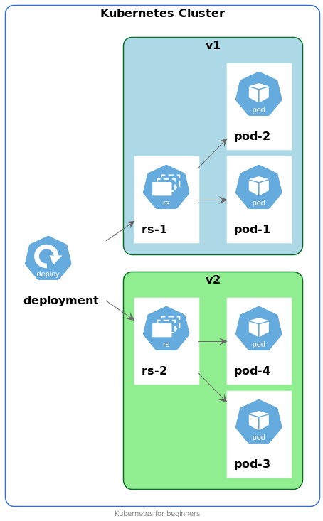

# Deployment
[Документация](https://kubernetes.io/docs/concepts/workloads/controllers/deployment/)

## Возможности
- следит за количеством и статусом запущенных подов;
- позволяет масштабировать приложение;
- хранит шаблон конфигурации пода и позволяет обновлять его;
- для масштабирования и версионирования использует ReplicaSet.

Для одного и того же Deployment в одно и то же время существует несколько ReplicaSet-ов.
За это отвечает параметр revisionHistoryLimit. По умолчанию это 10 ReplicaSet-ов.

## Демо
```shell script
kubectl get deploy
kubectl get rs
```

Имя пода выглядит примерно так: `grafana-5c8fb4c656-69qb2`.
Тут `grafana-5c8fb4c656` имя ReplicaSet.

## Обновление версии ПО
При необходимости обновления версии вашего ПО достаточно изменить Deployment.
Вы указываете образ новой версии, и дальнейший процесс происходит без вашего участия.

Вот как это выглядит на схеме:


После обновления `Deployment` будут существовать две версии `ReplicaSet` с одинаковым желаемым числом реплик.
Сначала будут созданы поды для нового `ReplicaSet`.
После их готовности принимать трафик, будет запущен процесс уменьшения числа реплик у старой версии `ReplicaSet`.
 
В зависимости от настроек политики обновления процесс обновления может происходить немного по-разному.

## Пример манифеста Deployment
```yaml
apiVersion: apps/v1
kind: Deployment
metadata:
  labels:
    app: multitool
  name: multitool
  namespace: default
spec:
  replicas: 1
  selector:
    matchLabels:
      app: multitool
  template:
    metadata:
      labels:
        app: multitool
    spec:
      containers:
        - image: praqma/network-multitool:alpine-extra
          imagePullPolicy: IfNotPresent
          name: network-multitool
          resources:
            limits:
              cpu: 200m
              memory: 512Mi
            requests:
              cpu: 100m
              memory: 256Mi
```

Другие примеры можно увидеть в папке `manifests`. 
