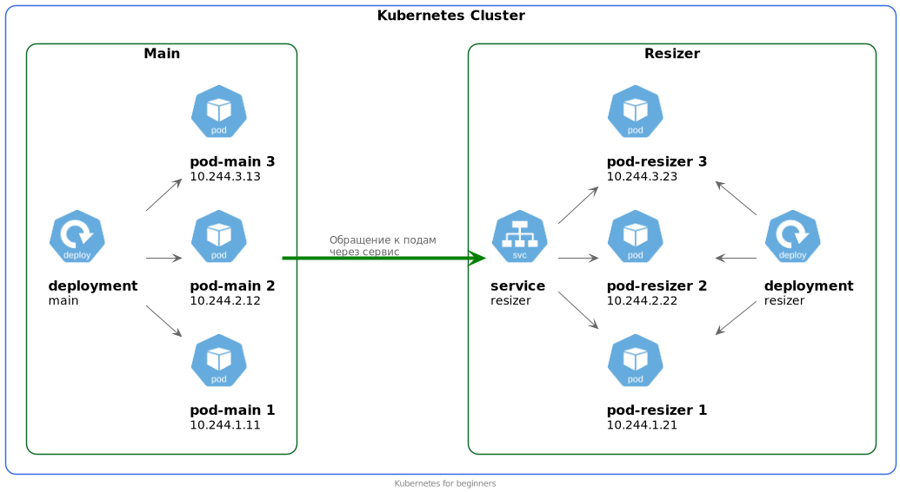

# Service
[Документация](https://kubernetes.io/docs/concepts/services-networking/service/)

## Возможности
- служит для маршрутизации сети в кластере;
- можно обратиться с любой ноды;
- выбирает поды для связки по меткам и селекторам;
- имеет свой IP-адрес (и dns-имя);
- обеспечивает балансировку.

## Причины появления объекта Service
Поды могут общаться между собой по IP. Проблема в том, что IP могут меняться после перезапуска (передеплоя). 
Добавление сервиса решает проблему.

Service обеспечивает сетевую связанность с подами. 
Поды становятся доступны друг для друга через обращение к поду по постоянному имени сервиса.

Кроме того при наличии нескольких реплик пода сервис обеспечивает балансировку нагрузки.

Имя сервиса должно соответствовать спецификации [DNS label name](https://kubernetes.io/docs/concepts/overview/working-with-objects/names#dns-label-names).

Контроллер по селекторам указанным в спецификации постоянно отслеживает создающиеся поды и создает Endpoints объекты или изменяет их.

Service может создавать маршруты с преобразованием номеров портов. 
По умолчанию targetPort = port.

В Pod можно указывать номер порта и его название. 
В спецификации сервиса имя порта является обязательным.

Один сервис может обслуживать несколько портов. Порты могут быть разных типов.

Если для сервиса указан селектор, то Endpoints будет создан автоматически.
В противном случае этот объект нужно будет создать вручную. 

## Типы сервисов
К некоторым частям вашего приложения вы можете захотеть обеспечить доступ внешнего мира. 
Например, внешний мир должен иметь доступ к frontend вашего приложения.
Или из кластера вы можете получить доступ к БД, которая находится вне кластера Kubernetes.
И тот и другой вариант доступа может быть обеспечен с помощью сервисов,

Есть несколько видов Kubernetes сервисов. Тип по умолчанию ClusterIP.

Тип сервиса определяет его поведение:

- ClusterIP: Выставляет сервис внутри кластера на внутреннем IP адресе. Такой сервис доступен только внутри кластера.
- [NodePort](https://kubernetes.io/docs/concepts/services-networking/service/#nodeport): 
    Делает доступным сервис на каждой ноде на статическом порту (NodePort). 
    Вы можете получить доступ к сервису снаружи кластера.
    При создании сервиса NodePort будет автоматически создан еще и сервис ClusterIP, к которому обращается сервис NodePort. 
    Номер порта для сервиса NodePort должен быть в диапазоне 30000-32767.
- [LoadBalancer](https://kubernetes.io/docs/concepts/services-networking/service/#loadbalancer): 
    Делает доступным сервис снаружи кластера с помощью облачного балансировщика нагрузки. 
    Автоматически создаются NodePort и ClusterIP сервисы, к которым обращается сервис LoadBalancer.

Сервис LoadBalancer может стать `Ready` только в случае если ваш облачный провайдер умеет создавать Load Balancer из этого ресурса.
В противном случае такой сервис зависнет в стадии `Pending`. 

## Схемы работы сервисов

Связь от пода к поду через сервис:



Связь от пода к внешней БД через сервис:


Связь снаружи кластера к поду через сервис:


## Демо
```shell script
kubectl get svc
```

## Пример манифеста Service
```yaml
apiVersion: v1
kind: Service
metadata:
  name: nginx
  namespace: default
spec:
  ports:
    - name: web
      port: 80
  selector:
    app: nginx
  type: ClusterIP
```

Другие примеры можно увидеть в папке `manifests`. 
