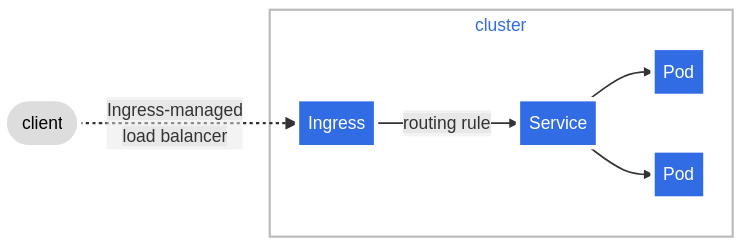

# Ingress
[Документация](https://kubernetes.io/docs/concepts/services-networking/ingress/)

Ingress обеспечивает доступ к приложениям снаружи кластера по http(https). 

Ingress может обеспечить балансировку нагрузки, SSL termination и доступ по доменному имени.



Для того чтобы была возможность создать ingress необходимо создать ingress controller. 
Ingress Controller-ы могут быть на базе различных ресурсов. 
Один из самых популярных nginx ingress controller

Весь список, который поддерживает Kubernetes в настоящий момент можно увидеть тут:

[https://kubernetes.io/docs/concepts/services-networking/ingress-controllers/](https://kubernetes.io/docs/concepts/services-networking/ingress-controllers/)


## Демо
```shell script
kubectl -n ingress-nginx get po
kubectl -n ingress-nginx get ds
```

ingress controller устанавливается в кластере как DaemonSet

## Пример манифеста Ingress
```yaml
apiVersion: networking.k8s.io/v1
kind: Ingress
metadata:
  namespace: default
  name: main
spec:
  rules:
    - host: main.akop.pw
      http:
        paths:
          - path: /
            pathType: Prefix
            backend:
              service:
                name: main
                port:
                  name: web
  tls:
    - hosts:
        - main.akop.pw
      secretName: akop
```
