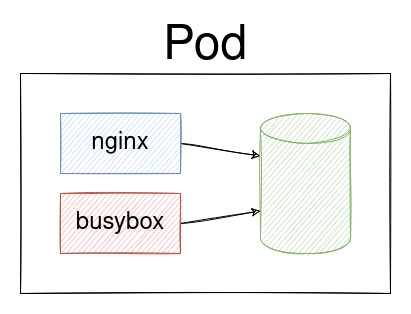
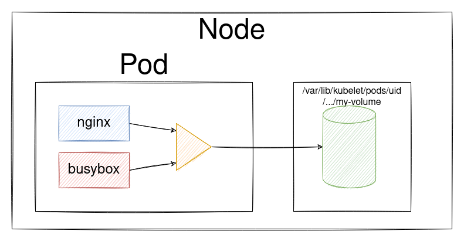

# Volume
[Документация](https://kubernetes.io/docs/concepts/storage/volumes/)

Volume и том в данном материале означает одно и то же.

## Схема пода с volume


## Манифест с volume
```yaml
kind: Pod
metadata:
  name: pod-int-volumes
spec:
  containers:
    - name: nginx
      image: nginx
      volumeMounts:
        - mountPath: "/static"
          name: my-volume
    - name: busybox
      image: busybox
      command: ["sleep", "3600"]
      volumeMounts:
        - mountPath: "/tmp/cache"
          name: my-volume
  volumes:
    - name: my-volume
      emptyDir: {}
```

### Примечание
- Том объявляется на уровне пода.
- Том монтируется внутрь нужного контейнера. 
- Путь монтирования объявляется на уровне отдельного контейнера.
- Этот путь для каждого из контейнеров может различаться.


Тип тома в данном манифесте emptyDir.
Это означает, что после перезапуска пода этот том будет пустым.

## Демо
```shell script
kubectl apply -f manifests/10-pod-int-volumes.yaml

kubectl get pods

# Создаем файл в контейнере nginx 
kubectl exec pod-int-volumes -c nginx -- sh -c "echo '42' > /static/42.txt"
# Проверяем файлы в контейнере nginx 
kubectl exec pod-int-volumes -c nginx -- ls -la /static

# Проверяем файлы в контейнере busybox 
kubectl exec pod-int-volumes -c busybox -- ls -la /tmp/cache

# Создаем файл в контейнере busybox 
kubectl exec pod-int-volumes -c busybox -- touch /tmp/cache/43.56
# Проверяем файлы в контейнере nginx 
kubectl exec pod-int-volumes -c nginx -- ls -la /static

# Создание файла размером 10 Мб
kubectl exec pod-int-volumes -c nginx -- dd if=/dev/zero of=/static/10mb.txt bs=1M count=10
```

### Где хранятся файлы
```shell script
# Определяем ноду на который запущен под
kubectl get po -o wide

# Или
kubectl get po pod-int-volumes -o yaml | grep nodeName

# Определяем uid пода
kubectl get po pod-int-volumes -o yaml | grep uid


# Заходим на эту ноду
# Ищем файл на ноде
find /var/lib/kubelet -name 42.txt

# Обратите внимание, что имя папки содержит uid пода

# Смотрим на содержимое найденной папки. Нужно скопировать имя папки
ls -la found-folder-name

# Смотрим одной командой на имя папки, в которой содержатся файлы нашего тома 
find /var/lib/kubelet/ -name my-volume | grep volumes

# Смотрим одной командой на содержимое папки, в которой содержатся файлы нашего тома 
find /var/lib/kubelet/ -name my-volume | grep volumes | xargs ls -la
```

Найденная папка вида:
`/var/lib/kubelet/pods/d7ecc26f-1d5e-4a91-99a1-3cb14dadf71b/volumes/kubernetes.io~empty-dir/my-volume/`

Где `d7ecc26f-1d5e-4a91-99a1-3cb14dadf71b` - это uid пода.
`my-volume` - имя тома в поде.

#### Удаляем под и проверяем наличие файлов.
```shell script
kubectl delete pod pod-int-volumes

# Смотрим на содержимое найденной папки. Нужно скопировать имя папки
ls -la found-folder-name
```

Такой папки нет. Более того нет папки самого пода.
Таким образом мы узнали, что все наши файлы исчезли.

При создании нового пода ему будет присвоен новый uid.
И том `my-volume` будет очевидно пустым.
Теперь становится понятно именование типа тома `emptyDir`.   

#### Дополнение
Можно исследовать на ноде папку, содержащую файлы и папки принадлежащие вашему поду.
Можете узнать много интересного.  

## Уточненная схема volume

