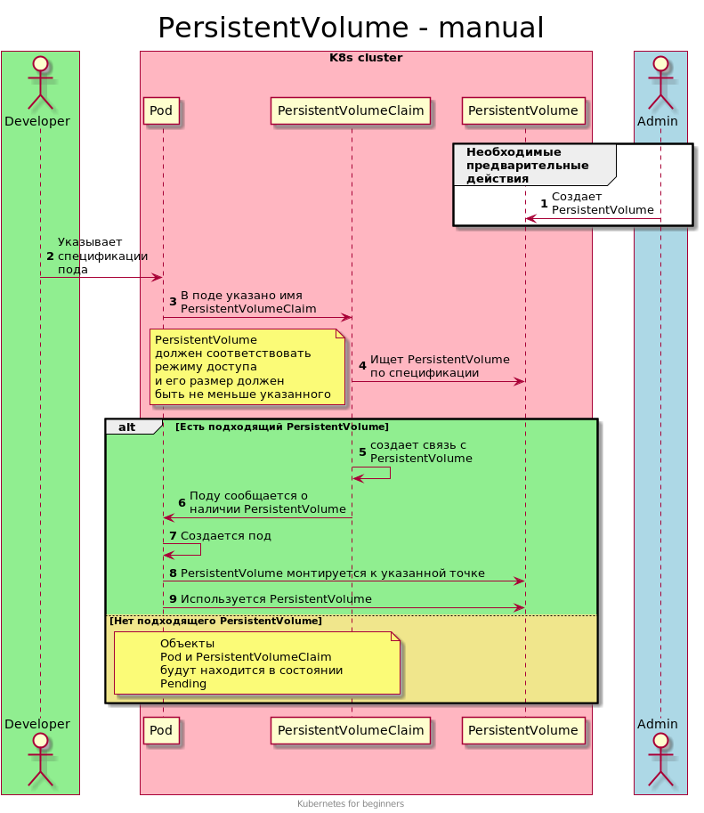

# Ручное управление Persistent Volume 
Для постоянного хранения данных в Kubernetes используются несколько объектов:
- PersistentVolume - выделенный том, в котором хранятся данные; 
- PersistentVolumeClaim - запрос (заявка) на выделение тома;
- StorageClass - класс хранилища, можно создавать самостоятельно при наличии provisioner.

Пока сосредоточимся на PersistentVolume и PersistentVolumeClaim.

## Схема работы
При ручном создании томов схема выглядит так:
- админ создает PersistentVolume;
- разработчик указывает характеристики необходимого тома;
- при развертывании приложения происходит какая-то магия и все работает.

Давайте подробнее рассмотрим как все работает.

 

### Первый запуск пода
- в спецификации пода необходимо указать ссылку на PersistentVolumeClaim (запрос на том);
- в спецификации PersistentVolumeClaim указываются необходимые параметры тома: размер и режим доступа;
- при наличии подходящего PersistentVolume происходит связывание объектов PersistentVolumeClaim и PersistentVolume;
- Pod запускается и к указанной точке монтируется запрошенный том.

### Последующие запуски пода
- в спецификации пода указана ссылка на PersistentVolumeClaim (запрос на том);
- PersistentVolumeClaim и PersistentVolume уже связаны;
- Pod запускается и к указанной точке монтируется запрошенный том.


## Демо
```shell script
# Создаем под
kubectl apply -f manifests/10-pod.yaml

# Проверяем создан ли под
kubectl get po
```

Pod в состоянии `Pending`. Нужно проверить в чем дело.
```shell script
kubectl describe pod pod
``` 

В самом низу мы видим:
```text
Events:
  Type     Reason            Age    From               Message
  ----     ------            ----   ----               -------
  Warning  FailedScheduling  4m40s  default-scheduler  persistentvolumeclaim "pvc" not found
```

У нас нет PersistentVolumeClaim с именем pvc. А согласно схеме работы этот объект должен быть.
 
Создадим его. 
```shell script
kubectl apply -f manifests/20-pvc.yaml

# Проверяем запущен ли под
kubectl get po

# Под в состоянии Pending
# Нужно смотреть дальше
kubectl get pvc
```

Теперь pvc есть, но он в состоянии `Pending`.
Проверим в чем же дело. Использовать будем привычную команду `kubectl describe` 

```shell script
kubectl describe pvc pvc
```

Получаем ответ вида:
```text
Events:
  Type    Reason         Age                   From                         Message
  ----    ------         ----                  ----                         -------
  Normal  FailedBinding  15s (x16 over 3m56s)  persistentvolume-controller  no persistent volumes available for this claim and no storage class is set
```

Нам нужен еще и PersistentVolume. Согласно схеме этот объект должен быть создан первым.

Для удобства откроем еще одно окно терминала. Это позволит наблюдать за происходящим.
```shell script
watch 'kubectl get po,pvc'
```

В первом окне терминала:
```shell script
kubectl apply -f manifests/30-pv.yaml

# Примерно через минуту pod и PersistentVolumeClaim перейдут в желаемые статусы
kubectl get po

# Проверим все наши объекты в одной команде
kubectl get po,pv,pvc
```

Теперь все объекты в желаемом состоянии.

## Проверка работы PersistentVolume
Как работают `volumes` в подах мы знаем. И знаем, что после перезапуска пода папка тоже удаляется.

PersistentVolume обещает нам сохранение данных. Проверим это. 

### Типы PersistentVolume
[Список доступных типов PersistentVolume](https://kubernetes.io/docs/concepts/storage/persistent-volumes/#types-of-persistent-volumes)

В данном примере мы использовали самый простой тип PersistentVolume - `hostPath`. 
При его использовании данные помещаются **на ноде** в указанной папке.
Этот тип очень удобен для демонстрации возможностей PersistentVolume.
 
Проверим это
```shell script
# Создаем файл привычным способом
kubectl exec pod -- sh -c "echo 42 > /static/42.txt"

# запускаем на ноде
ls -la /data/pv
cat /data/pv/42.txt

# Запишем новый файл на ноде
echo 43 | sudo tee /data/pv/43.txt

# Проверяем наличие файлов в поде
kubectl exec pod -c nginx -- ls -la /static
kubectl exec pod -c nginx -- cat /static/43.txt
```

Таким образом файлы доступны на ноде и в поде.

### Постоянство данных с использованием PersistentVolume
Нужно проверить останутся ли данные после удаления пода.
```shell script
kubectl delete po pod

# запускаем на ноде
ls -la /data/pv
# Данные на ноде остались 

# Проверим состояние PersistentVolume и PersistentVolumeClaim
kubectl get pv,pvc
# Тут тоже все в порядке. Ничего не удалилось все работает.
```

Мы увидим, что данные сохранились.
Пересоздадим под и убедимся, что в поде все так же доступны данные.
```shell script
# Создаем под заново
kubectl apply -f manifests/10-pod.yaml

# Проверяем доступность данных
kubectl exec pod -- ls -la /static
```
**Данные могут быть на месте только при одно-нодовой конфигурации.**

