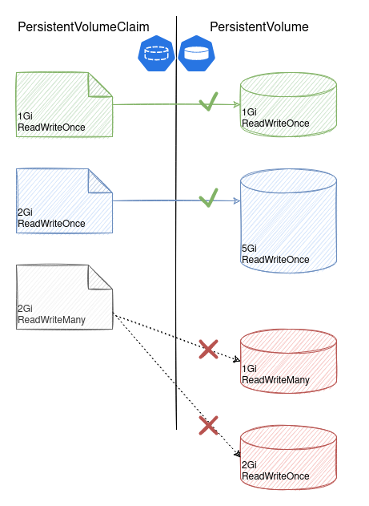

# Детали о PersistentVolume, PersistentVolumeClaim
Мы уже знаем, что к поду может примонтирована папка,  
PersistentVolumeClaim и PersistentVolume могут быть связаны только при следующих условиях:
- размер PersistentVolume равен или больше чем запрошенный размер в PersistentVolumeClaim;
- AccessMode в PersistentVolume и AccessMode в PersistentVolumeClaim должны совпадать. 

**Примечание**
Если PersistentVolumeClaim запрашивает 10Gb, а размер подходящего PersistentVolume будет равен 100Gb, то в поде будут доступны все 100Gb.

## Связывание PersistentVolume и PersistentVolumeClaim


## Пример манифестов
```yaml
apiVersion: v1
kind: PersistentVolumeClaim
metadata:
  name: pvc
spec:
  accessModes:
    - ReadWriteOnce
  resources:
    requests:
      storage: 2Gi

---
apiVersion: v1
kind: PersistentVolume
metadata:
  name: pv
spec:
  accessModes:
    - ReadWriteOnce
  capacity:
    storage: 2Gi
  hostPath:
    path: /data/pv
  persistentVolumeReclaimPolicy: Retain
```

## AccessMode (режимы доступа к томам)
- ReadWriteOnce - volume может быть примонтирован в режиме чтения и записи только к одной ноде. 
    Можно использовать для монтирования несколькими подами, но тогда поды должны быть запущены на одной ноде.
- ReadOnlyMany - volume может быть примонтирован в режиме только чтения ко множеству нод.
- ReadWriteMany - volume может быть примонтирован в режиме чтения и записи ко множеству нод.
- ReadWriteOncePod - volume может быть примонтирован в режиме чтения и записи только к одному поду.
    Используйте этот режим если хотите быть уверенными, что только один pod имеет доступ к файлам этого volume.
    Этот режим поддерживается для `CSI volumes` и Kubernetes версии 1.22+. 

## ReclaimPolicy
[Документация](https://kubernetes.io/docs/concepts/storage/persistent-volumes/#reclaiming)
Наступает момент когда том, в котором хранились данные, становится не нужен.
Тогда можно удалить том. 

Последовательность удаления ненужного тома:
- удаление пода;
- удаление PVC, который связан с PV;
- удаление PV;
- удаление внешнего ресурса, который был выделен для тома.

Для управления удалением внешнего ресурса существует параметр ReclaimPolicy. 

В настоящий момент используются такие виды политик:
- Retain - после удаления PersistentVolume ресурсы из внешних провайдеров **автоматически не удаляются**.
- Delete - после удаления PersistentVolume ресурсы из внешних провайдеров **автоматически удаляются**. 
- Recycle - устаревшее

Самым удобным является вариант `Delete`. Но не все CSI драйверы поддерживают такой режим.
