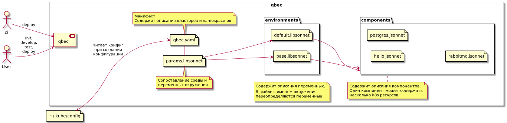

# Qbec
Решение для развертывания приложений в разные кластеры с применением всех возможностей [jsonnet](https://jsonnet.org/).

Примечание. Среда и окружение в рамках этой темы означают одно и то же. 



## Настройка
### qbec.yaml 
содержит настройки подключения к различным кластерам.

Есть настройка по умолчанию. У этой настройки имя default.

### params.libsonnet
Содержит переменные окружения для кластеров. На выходе возвращается объект вида:
```json
{
  "_": {},
  "default": {},
  "stage": {}
}
``` 
в объекте `_` содержатся базовые переменные окружения, которые могут быть переопределены специфическими переменными окружения для конкретного окружения.  

Переменные окружения могут импортироваться из отдельных файлов.

#### Папка environments
Содержит реальное описание переменных окружения для разных окружений.
Каждый из файлов представляет собой аналог `values.yaml` для Helm. 

- `base.libsonnet` - содержит базовый набор переменных окружения. Может содержать весь набор переменных, используемых в шаблонах.   
- `default.libsonnet` - содержит набор переменных окружения для деплоя в кластер по умолчанию. Может содержать только часть переменных окружения. Именно эти переменные и будут замещать собой переменные окружения из файла `base.libsonnet`  
- `stage.libsonnet` - то же, что и `default.libsonnet`, но для другого кластера.  

Пример файла:
```jsonnet
local base = import './base.libsonnet';

base {
  components +: {
    hello +: {
      indexData: 'hello default 42\n',
      replicas: 8,
      repl: 2,
    },
  }
}
```

`+` - означает расширение объекта

В описании переменных окружения могут быть переопределены переменные.
Все используемые в компонентах переменные должны быть определены в базовом объекте.


Переменные используются для расчетов и кастомизации компонентов.

### Папка components 
Содержит компоненты ресурсов Kubernetes.

```shell script
qbec show default # show the YAML that would be applied to the server

qbec component list default # list all components

qbec param list default  # list all parameters

qbec show -O default # show all object names instead of contents
```

```shell script
qbec show -k deployment default # only shows the deployment but not configmap

qbec show -K deployment default # only shows the configmap and excludes the deployment

qbec show -C hello default # no output since the only component has been excluded
```

```shell script
qbec validate default # validates local objects against server metadata

qbec diff default # shows a diff between remote and local objects

qbec apply default  # applies the components to an environment similar to kubectl apply

# Посмотреть созданный ConfigMap
kubectl get cm
```
